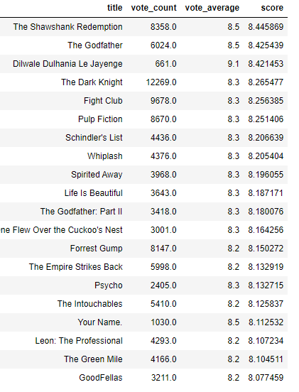

# RecommenderSystem_Movie_Ratings

*A recommender system that utilizes aggregate movie ratings to determine the highest-quality movies.*

### References

Dataset: https://grouplens.org/datasets/movielens/latest/

Model: https://www.datacamp.com/tutorial/recommender-systems-python
